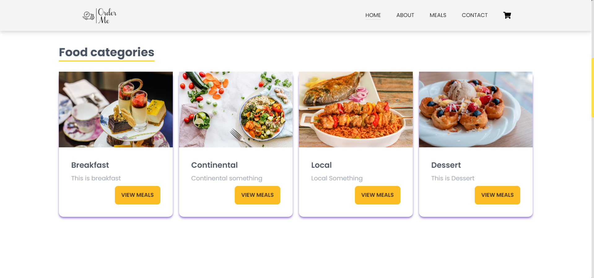
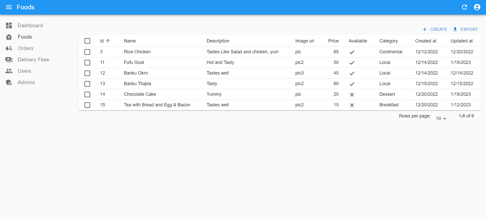

# Order Me

A Food Ordering System.

## Table of Contents

- [General Info](#general-info)
- [Screenshots](#screenshots)
- [Technologies](#technologies)
- [Languages](#languages)
- [Features](#features)
- [Installation](#installation)
- [Usage](#usage)
- [Contributors](#contributors)

## General Info

Order Me is a food ordering system that provides both users and administrators with a user-friendly interface to manage food orders, user information, and site details. The system consists of a user interface and an administrator panel.

## Screenshots

## Technologies

The Order Me project utilizes the following technologies:

- Node.js and npm (Node Package Manager)
- Express.js
- PostgreSQL (Database Management System)
- HTML
- CSS
- React

## Languages

- JavaScript

## Features

Order Me includes the following features:

### User Interface:

- Place an order
- Check the status of placed orders (requires user account)

### Administrator Panel:

- Manage foods (prices, names, descriptions, etc., shown in the user interface)
- Manage orders
- Manage delivery fees
- View users
- View administrators
- Download reports in xlsx (Excel) format for each table

## Installation

To run the project locally, follow these steps:

### Backend

1. Make sure you have [PostgreSQL](https://www.postgresql.org/download) and [Node](https://nodejs.org/en/download/) installed on your machine.

2. Open your terminal and navigate to the `backend` directory.

3. Create a `.env` file following the structure in `.env.example`.

4. Change the username and password in `config.json` in the `config` folder to match your PostgreSQL setup. It currently contains the default values of PostgreSQL.

5. Run `npm i` to install all dependencies.

6. Run `npm start` to start the server.

### Frontend

1. Open your terminal and navigate to the `Frontend` directory.

2. Run `npm i` to install all dependencies.

3. Run `npm start` to start the application.

### Admin

1. Open your terminal and navigate to the `Admin` directory.

2. Run `npm i` to install all dependencies.

3. Run `npm start` to start the application.

4. On Windows, you can run `npm electron start` to run a native version of the app or `npm electron build` to build a native version of the app.

5. Sign in to the admin panel using your credentials. The system creates an admin user when you run the server for the first time. Username and password for that is `admin`

## Contributors

- [Michael Hagan](https://github.com/michaelhagan)
- [Tracy Sarah Afram-Owusu](https://github.com/tracy1-sarah)
